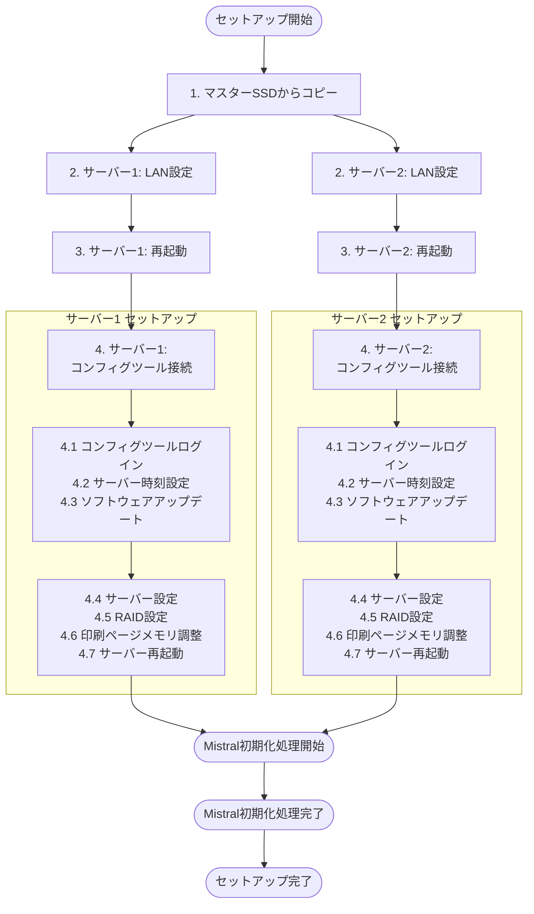

# プリントサーバー セットアップフローチャート

以下は、プリントサーバーが2台構成の場合のセットアップ手順のフローチャートです。

```mermaid
graph TD
    Start([セットアップ開始]) --> Copy[1. マスターSSDからコピー]
    
    Copy --> S1_LAN[2. サーバー1: LAN設定]
    Copy --> S2_LAN[2. サーバー2: LAN設定]
    
    S1_LAN --> S1_Reboot[3. サーバー1: 再起動]
    S2_LAN --> S2_Reboot[3. サーバー2: 再起動]
    
    S1_Reboot --> S1_Setup[4. サーバー1:<br>コンフィグツール接続]
    S2_Reboot --> S2_Setup[4. サーバー2:<br>コンフィグツール接続]
    
    subgraph Server1[サーバー1 セットアップ]
        S1_Setup --> S1_Group1["4.1 コンフィグツールログイン<br>4.2 サーバー時刻設定<br>4.3 ソフトウェアアップデート"]
        S1_Group1 --> S1_Group2["4.4 サーバー設定<br>4.5 RAID設定<br>4.6 印刷ページメモリ調整<br>4.7 サーバー再起動"]
    end
    
    subgraph Server2[サーバー2 セットアップ]
        S2_Setup --> S2_Group1["4.1 コンフィグツールログイン<br>4.2 サーバー時刻設定<br>4.3 ソフトウェアアップデート"]
        S2_Group1 --> S2_Group2["4.4 サーバー設定<br>4.5 RAID設定<br>4.6 印刷ページメモリ調整<br>4.7 サーバー再起動"]
    end
    
    S1_Group2 --> MistralStart([Mistral初期化処理開始])
    S2_Group2 --> MistralStart
    
    MistralStart --> MistralEnd([Mistral初期化処理完了])
    MistralEnd --> SetupEnd([セットアップ完了])
```
